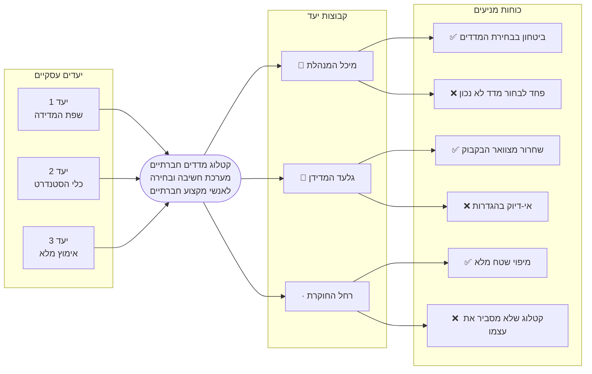

# מפת טריגרים — קטלוג מדדים חברתיים | JDC DIDA

> שלב 2 — מיפוי טריגרים
> מקור: ורקשופים 1–4, product-brief.md
> סטטוס: טיוטה — ממתין לאישור

---

## המפה

---

## יעדים עסקיים

| יעד | חזון | מטרות מרכזיות |
|-----|------|----------------|
| G1 | שפת המדידה | הכרה מוסדית · נוכחות בשיח המקצועי · משיכה חיצונית |
| G2 | כלי הסטנדרט | 5+ ארגונים חיצוניים · ציטוט ב-3 מסמכי מדיניות · ביקוש להרחבה |
| G3 | אימוץ מלא | ביזור הידע · 100% שימוש פנימי · שיפור איכות תכנון |

→ פירוט מלא: [01-business-goals.md](01-business-goals.md)

---

## קבוצות יעד

| עדיפות | פרסונה | יעדים | קובץ פרסונה |
|--------|---------|--------|-------------|
| 👥 ראשית | מיכל המנהלת | G1, G2, G3 | [02-persona-michal-the-manager.md](02-persona-michal-the-manager.md) |
| 👤 שנייה | גלעד המדידן | G1, G2, G3 | [03-persona-gilad-the-expert.md](03-persona-gilad-the-expert.md) |
| · שלישית | רחל החוקרת | G1, G2 | [04-persona-rachel-the-researcher.md](04-persona-rachel-the-researcher.md) |

---

## כוחות מניעים — סיכום עדיפויות

ממוינים לפי ציון FIA (תדירות + עצמה + התאמה, /15). ציונים 13 ומעלה = קלט עיצובי בעדיפות גבוהה.

| ציון | כוח | קבוצה | כיוון |
|------|-----|--------|-------|
| **15** | ביטחון בבחירת המדדים | מיכל | ✅ חיובי |
| **15** | פחד לבחור מדד לא נכון | מיכל | ❌ שלילי |
| **15** | שחרור מצוואר הבקבוק | גלעד | ✅ חיובי |
| **14** | חיסכון אמיתי בזמן | מיכל | ✅ חיובי |
| **14** | תלות ב"שומרי הידע" | מיכל | ❌ שלילי |
| **14** | בזבוז זמן בלי וודאות | מיכל | ❌ שלילי |
| **14** | מיפוי שטח מלא | רחל | ✅ חיובי |
| **13** | השוואת מתודולוגיות | רחל | ✅ חיובי |
| **12** | שפה משותפת עם עמיתים | מיכל | ✅ חיובי |
| **12** | לגיטימציה מול הנהלה | מיכל | ✅ חיובי |
| **12** | תחושת חשיפה מול הנהלה | מיכל | ❌ שלילי |
| **12** | תכנית שנראית לא מקצועית | מיכל | ❌ שלילי |
| **12** | אי-דיוק בהגדרות | גלעד | ❌ שלילי |
| **12** | חוסר יכולת השוואה | רחל | ❌ שלילי |

**קריאה מרכזית:** מיכל שולטת בעדיפויות הגבוהות ביותר — כוחותיה הם הדחף המרכזי לעיצוב. הכוחות השליליים (פחד מבחירה שגויה, תלות באנשים, בזבוז זמן) חזקים לא פחות מהחיוביים — מה שאומר שהמוצר צריך קודם לפתור כאב, ורק אחר כך לספק שמחה. כוחות גלעד ורחל מציינים דרישות עומק ודיוק שלא ניתן להתפשר עליהן.

---

*הופק על ידי Saga — 7 במאי 2026*
*מקור: 01-business-goals.md, 02–04-persona-*.md*
